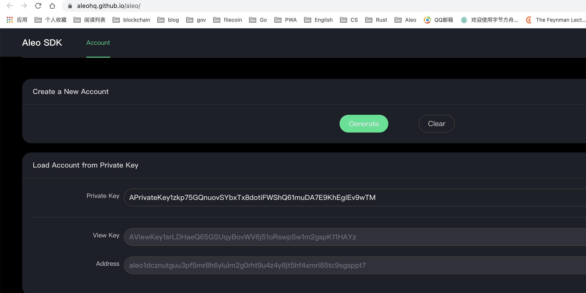

## Deploy application use transaction broadcast

### [BRF Aleo](https://github.com/bitrainforest/aleo/tree/brf)

通过broadcast transaction的方式在local node 上Deploy应用。

#### 和官方程序的区别
- node server新增faucet http 接口, 部署应用需要fee
- 新增deploy命令: aleo deploy "record json"

### How
#### compile
```
git clong -b brf https://github.com/bitrainforest/aleo.git
cd aleo
cargo install --path .
```

#### start local node
```sh
cd example/token
# not deploy token program
aleo node start nodeploy
⏳ Starting a local development node for '**token.aleo**' (in-memory)...
  
 • Loaded universal setup (in 5011 ms)

 • Executing 'credits.aleo/genesis'...

 • Executed 'genesis' (in 2610 ms)

 • Loaded universal setup (in 1902 ms)

 • Verified 'genesis' (in 50 ms)

 • Verified 'genesis' (in 49 ms)

🌐 Server is running at http://0.0.0.0:4180

 • Executing 'credits.aleo/transfer'...

 • Executed 'transfer' (in 4037 ms)

 • Verified 'transfer' (in 54 ms)

 • Verified 'transfer' (in 48 ms)

  
🛡️  Produced block 1 (ab1xjzgnr4cak0lsgretxz8wcmj866e0mj4ty9f7unxcmacm6hj8ygsyjn8q7)

{

  "previous_state_root": "7095828213447299132450689444509248408311483460788655207390840042474579409393field",

  "transactions_root": "2297083622538701470664808631702666015392189335310042668987947589513566222157field",

  "metadata": {

    "network": 3,

    "round": 1,

    "height": 1,

    "coinbase_target": 18446744073709551615,

    "proof_target": 18446744073709551615,

    "timestamp": 1660401541

  }

}
```

#### deploy hello program

```sh
cd example/hello #or aleo new hello

cat program.json      
{

    "program": "hello.aleo",

    "version": "0.0.0",

    "description": "",

    "development": {

        "private_key": "APrivateKey1zkp75GQnuovSYbxTx8dotiFWShQ61muDA7E9KhEgiEv9wTM",

        "address": "aleo1dcznutguu3pf5mr8h6ylulm2g0rht9u4z4y8jt5hf4xmrl85tc9sgsppt7"

    },

    "license": "MIT"

}
```

##### get view_key



##### 调用faucet向hello address转账
![[faucet.png]](./images/faucet.png)

##### 通过hello的view_key查询生成的record
![[records_all.png]](./images/records_all.png)

##### 通过deploy命令部署应用。会生成transaction(deploy)，然后调用POST /testnet3/transaction/broadcast 发送给local node
```sh
aleo deploy "{owner: aleo1dcznutguu3pf5mr8h6ylulm2g0rht9u4z4y8jt5hf4xmrl85tc9sgsppt7.private, gates: 100u64.private, _nonce: 2989149249678168785473970534067991414099513141846903270611741494968954281998group.public}"

 • Loaded universal setup (in 2762 ms)

 • Built 'hello' (in 11483 ms)

 • Certified 'hello': 349 ms

 • Calling 'credits.aleo/fee'...

 • Executed 'fee' (in 3941 ms)

 • Verified certificate for 'hello': 113 ms

 • Verified 'fee' (in 63 ms)

sending transaction broadcast...

OK
```

#### 查询部署成功

![[block.png]](./images/block.png)


#### TODO：add execute  command